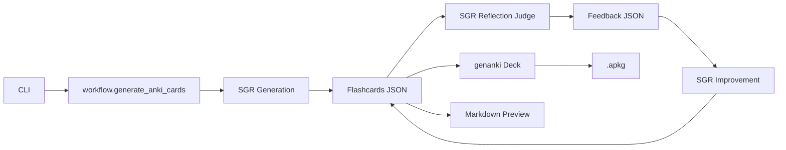

# Repository Guidelines

## Project Structure & Module Organization

- `src/anything2anki/`: Python package.
  - `cli.py`: CLI argument parsing and entry.
  - `workflow.py`: Core workflow (SGR-driven generation → reflection/judge → improvement; LLM calls, JSON parsing, deck build).
  - `anki_model.py`: Deck/model definitions using `genanki`.
  - `prompts.py`: System/user prompt templates.
  - `__main__.py`: Enables `python -m anything2anki`.
- `tests/`: Pytest tests (mirror `src/` paths).
- `pyproject.toml`: Build, dependencies, and tooling.

## Build, Test, and Development Commands

- Install (dev): `uv sync --dev`
- Lint: `uv run ruff check .` (fixes with `--fix` if desired)
- Format: `uv run ruff format .`
- Run CLI:
  - Installed: `anything2anki input.txt "What to learn" -o deck.apkg`
  - Module: `uv run python -m anything2anki input.txt "What to learn" -o deck.apkg`
- Tests (when present): `uv run pytest tests/`

Flags of note:

- `--preset` to select prompt specialization (guides SGR behavior: `general|cloze|concepts|procedures|programming`).
- `--max-reflections` to control reflection→improvement cycles (`0` disables judge/improve loop).

## Coding Style & Naming Conventions

- Python 3.12+, 4‑space indentation, UTF‑8 files.
- Use type hints where practical; write concise docstrings.
- Naming: modules/packages `snake_case`; classes `PascalCase`; functions/vars `snake_case`; constants `UPPER_CASE`.
- Use `ruff` for both linting and formatting; keep imports clean.

## Testing Guidelines

- Framework: `pytest` with tests under `tests/` named `test_*.py`.
- Mirror package structure (e.g., `tests/test_workflow.py`).
- Mock external calls to `aisuite`/network; do not require real API keys.
- Add tests alongside new logic; prefer small, deterministic units.

## Commit & Pull Request Guidelines

- Commit style: Prefer Conventional Commits (e.g., `feat:`, `fix:`, `docs:`).
- PRs should include: purpose/impact, brief before/after, usage example (CLI snippet), and linked issues.
- Update README or this guide when changing commands or structure.

## Security & Configuration Tips

- Secrets: copy `.env.example` to `.env`; set `OPENAI_API_KEY`. Do not commit `.env` or secrets.
- Generated artifacts: do not commit `.apkg` files; treat them as local outputs.
- The model can be changed via `--model` (default `openai:gpt-5-mini`).

## Architecture Overview

## Agent-Specific Instructions

- Keep changes minimal and focused; avoid new dependencies without need.
- Follow this document’s style and commands; prefer `uv` for all tasks.
