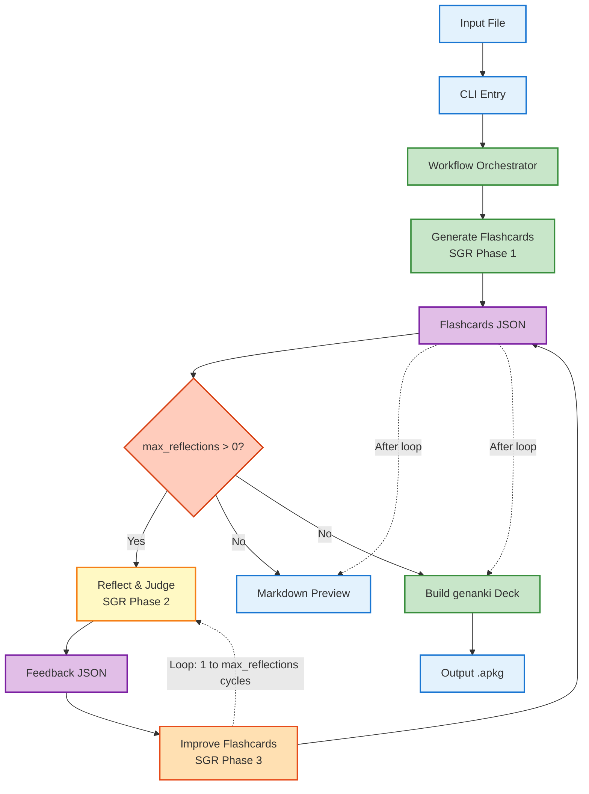
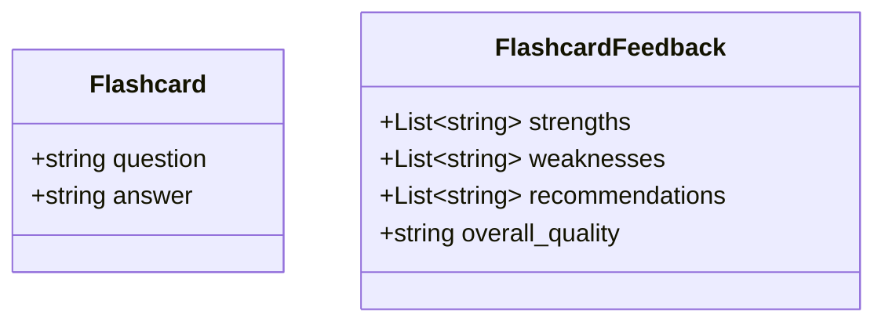

# Anything2Anki

Generate Anki decks from plain text using an LLM (via the `aisuite` SDK). The tool reads a local text/Markdown file, asks a language model to extract clear Q&A pairs, and builds a `.apkg` file you can import into Anki. The generation is implemented as a workflow with Schema-Guided Reasoning (SGR): generation → reflection (judge evaluation) → improvement.

- LLM provider: `aisuite` (OpenAI enabled by default)
- Default model: `openai:gpt-5-mini`
- Output: Anki `.apkg` deck built with `genanki`

## How It Works

1. Read input file contents (UTF‑8 text/Markdown).
2. Build prompts: system + user prompts that embed your learning objective and the file’s content.
3. Generation with SGR: call the LLM (`--model`, default `openai:gpt-5-mini`) to produce JSON flashcards matching a strict schema.
4. Reflection (judge) with SGR: evaluate the cards to produce structured feedback (`FlashcardFeedback`). Controlled by `--max-reflections` (>0 enables; 0 disables).
5. Improvement with SGR: regenerate cards using the feedback to refine clarity, coverage, and correctness.
6. Create a simple Q&A Anki model and deck using `genanki` and write a Markdown preview report.
7. Write a `.apkg` file ready to import into Anki.

If the model returns non‑JSON output or no Q&A pairs, the run fails with a helpful error. Large inputs and poorly formatted content can reduce quality; consider pruning inputs to the most relevant sections.

## Installation

This project uses [uv](https://github.com/astral-sh/uv) for dependency management.

```bash
uv sync
```

This installs dependencies and the package in editable mode. Alternatively:

```bash
uv pip install -e .
```

## Setup

Environment variables are loaded automatically from a local `.env` at the project root (see `src/anything2anki/__init__.py`). Configure provider credentials as needed for your chosen model. For OpenAI models, set `OPENAI_API_KEY`.

```bash
cp .env.example .env
echo "OPENAI_API_KEY=sk-..." >> .env
```

You can also export variables directly in your shell:

```bash
export OPENAI_API_KEY=sk-...
```

Notes:

- The project depends on `aisuite[openai]`, so OpenAI works without extra setup. Other providers can be used if supported by `aisuite` and available in your environment; pass their (optionally provider-qualified) model name to `--model`.
- Never commit real API keys; `.env` is in `.gitignore`.

## Usage

### CLI

Basic usage (output defaults to `<input>.apkg`):

```bash
anything2anki input.txt "Extract key concepts and definitions"
```

Explicit output path and model:

```bash
anything2anki input.md "Extract key concepts and definitions" \
  --output data/civics.apkg \
  --model openai:gpt-5-mini

Preview only (skip .apkg, just write Markdown preview next to the would-be output path):

```bash
anything2anki input.md "Extract key concepts" --preview-only
```

```

Run as a module (useful with `uv`):

```bash
uv run python -m anything2anki data/input.md \
  "Extract all terms and definitions" -o data/output.apkg --model openai:gpt-5
```

CLI options:

- `file_path` (positional): Path to the input text/Markdown file.
- `learning_description` (positional): What to learn/extract (drives the prompt).
- `--output, -o`: Output `.apkg` path. Defaults to `<input>.apkg`.
- `--model, -m`: LLM model (default `openai:gpt-5-mini`).
- `--preview-only`: Only generate the Markdown preview report and skip creating the `.apkg` deck.
- `--preset`: Prompt specialization preset to guide Schema-Guided Reasoning. Choices:
  - `general` (default): balanced, clear fact extraction.
  - `cloze`: atomic facts and short noun-phrase answers suited to cloze deletions.
  - `concepts`: focuses on why/how questions and mechanisms over trivia.
  - `procedures`: emphasizes step order, pre/postconditions, and workflows.
  - `programming`: stresses API names, invariants, correctness, and edge cases.
- `--max-reflections`: Number of reflection→improvement cycles (default: 1). Set to `0` to disable judge/improve loop.

### Python API

```python
from anything2anki import generate_anki_cards

generate_anki_cards(
    file_path="input.txt",
    learning_description="Extract key concepts and definitions",
    output_path="output.apkg",
    model="openai:gpt-5-mini",  # optional, default shown
    preview_only=False,          # optional
    max_reflections=1,           # optional: 0 disables reflection
    prompt_preset="general",    # optional: general|cloze|concepts|procedures|programming
)
```

## Models

- Default: `openai:gpt-5-mini`.
- Override with `--model` or the `model` argument in the Python API.
- Model naming follows `aisuite` conventions. If using a provider-qualified model like `openai:gpt-4o`, ensure credentials are configured.

## Workflow Details

- SGR prompts: see `src/anything2anki/prompts.py` for system prompts across three phases—generation, reflection (judge), and improvement—plus user prompts. Prompts enforce strict schemas for flashcards and feedback.
- Parsing: generation extracts the first `[` … last `]` slice to tolerate Markdown fences, then validates against the pydantic schema. Reflection parses a JSON object into `FlashcardFeedback`.
- Reflection and judge: the reflection step returns structured critique (strengths, weaknesses, recommendations, overall quality). The improvement step uses this to revise cards. Control cycles with `--max-reflections`.
- Deck/model: a two‑field “Question / Answer” model in `src/anything2anki/anki_model.py`; deck named "Generated Deck". Each Q&A becomes one note.
- Packaging: the deck is exported as `.apkg` using `genanki` and written to `--output`. A Markdown preview is written alongside the output path.

### Architecture



### Schemas



## Project Structure

```
anything2anki/
├── src/
│   └── anything2anki/
│       ├── __init__.py      # Loads .env; exposes generate_anki_cards
│       ├── __main__.py      # Enables `python -m anything2anki`
│       ├── cli.py           # CLI entry and args
│       ├── workflow.py      # Core logic (LLM call, JSON, deck build)
│       ├── anki_model.py    # `genanki` deck/model definitions
│       └── prompts.py       # System and user prompt templates
├── tests/                   # Pytest tests (when present)
├── pyproject.toml           # Build, deps, and tooling
└── README.md
```

## Development

Install with dev tools:

```bash
uv sync --dev
```

Lint and format with Ruff:

```bash
uv run ruff check .
uv run ruff format .
```

### Tests

Place tests under `tests/` and run with:

```bash
uv run pytest tests/
```

## Requirements

- Python 3.12+
- [uv](https://github.com/astral-sh/uv)
- Provider API keys as needed (e.g., `OPENAI_API_KEY` for OpenAI models)
- Anki (to import the resulting `.apkg`)

## Tips & Limitations

- Keep inputs focused. Very large files can exceed context limits and reduce quality.
- The model must return valid JSON; custom instructions in your learning description should not conflict with that requirement.
- The deck name is currently fixed to "Generated Deck"; changeable by editing `create_deck()`.
